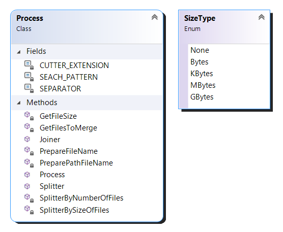

# FileCutter
Library to split a large file into small ones, and join them again to the original large file

> This library is based [in other code [**FileUtilities**]](https://github.com/J0rgeSerran0/FileUtilities) that I wrote some years ago. 
> The motivation to do this, is to resolve an issue found in the original code and do the library simpler


## Diagram 



## How to

> **Note:** *The original files in the split or join actions, are deleted by default. If you don't want to delete the original file or the cutter files, you should indicate this in the parameters of the *Splitter* and *Joiner* methods.*

### **Split Files**

> Using the **Splitter** method

```csharp
Splitter(string inputFile, int chunkFiles, SizeType sizeType = SizeType.None, bool deleteOriginFile = true)
```

* This code show you how to split a large file into files of 4 Megabytes:
```csharp
var fileCutterProcess = new FileCutter.Process();
fileCutterProcess.Splitter(@"C:\Temp\BigFile.txt", 4, SizeType.MBytes);
```

* This code show you how to split a large file into 5 files:
```csharp
var fileCutterProcess = new FileCutter.Process();
fileCutterProcess.Splitter(@"C:\Temp\BigFile.txt", 5);
```

### **Join Files**

> Using the **Joiner** method

```csharp
Joiner(string outputPath, bool deleteCutterFiles = true)
```
 
* This code show you how to join the splitted files, to the original file:
```csharp
var fileCutterProcess = new FileCutter.Process();
fileCutterProcess.Joiner(@"C:\Temp");
```

> Note: the join action look for files with the **.cut** extension.
